# ATLAS Climate Intelligence Platform

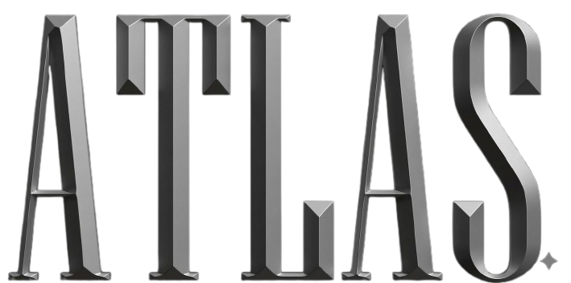

ATLAS is a dark, multi-page Streamlit climate product built around stable live APIs, historical NetCDF analysis, risk scoring, model-assisted forecasting, and report generation. It unifies data from NASA, NOAA, OpenWeather, and local climate models into a single mission-control interface.

The current build blends:

- **Liquid glassmorphism** — animated frosted-glass panels with shimmer sweeps and ambient blob drift
- **Mission Control aesthetic** — Space Grotesk headlines, Geist body, JetBrains Mono data
- **Scientific Vanguard styling** — atmospheric cyan accents, emergency amber alerts, critical red risks
- **Light / Dark mode** — toggleable with persistent OS preference detection

---

## Why ATLAS? — Comparison with Other Climate Platforms

| Dimension | ATLAS | NASA Earthdata / NOAA CDO / Copernicus CDS | Enterprise platforms (EarthScan, Jupiter, Climate X) | OS-Climate / CLIMADA | ClimateIQ AI |
|-----------|-------|--------------------------------------------|------------------------------------------------------|----------------------|--------------|
| **Cost** | Free (open-source, Streamlit Cloud) | Free (data only) | $10k–$100k+/year enterprise | Free (library) | Free (open-source) |
| **Deployment** | 1-click Streamlit Cloud; local too | Web portal only (no self-host) | SaaS / enterprise install | Python library, no UI | Vercel / self-host |
| **Live API integration** | NASA GIBS, NOAA CDO, OpenWeather built-in | Each is its own silo | Proprietary data feeds | Manual data ingestion | NASA FIRMS, OpenWeather, NREL |
| **Offline mode** | Built-in (fallback synthetic data) | Not available | Not available | Not applicable | No fallback |
| **Risk scoring engine** | Flood, wildfire, heatwave, storm, AQI — real-time + historical | Not available | Core product (11+ hazards) | physrisk library (Python) | Not available |
| **AI predictions** | Model-assisted forecasting + NL queries | Not available | Some ML (Jupiter uses ML) | Not available | Gemini multi-agent |
| **NetCDF support** | Native (xarray, heatmaps, globes, profiles) | Raw data portals | Not available | Supported | Not available |
| **Report generation** | PDF + Markdown with ReportLab | Not available | Some (EarthScan auto-reports) | Not available | Not available |
| **Story / narrative mode** | Guided climate narrative with chapters | Not available | Not available | Not available | Not available |
| **UI / UX** | Stitch Mission Control design (glassmorphism, animated, dark/light) | Functional / academic | Professional but generic | CLI / notebook only | Tailwind CSS |
| **Multi-page workspace** | 10 integrated modules | Separate portals per dataset | Dashboard only | Not applicable | Single-page app |
| **Research Lab** | Dataset upload, scenario simulation, model testing | Not available | Not available | Available (Python) | Not available |
| **Custom design system** | Atmos Mission Control (Stitch MCP) | Not applicable | Enterprise branding | Not applicable | No |
| **Light/Dark mode** | OS-aware persistent toggle | Light only | Varies | N/A | Light only |

### Where ATLAS excels

1. **Only free platform that unifies live APIs + offline NetCDF + risk scoring + AI predictions in one deployable app.** Enterprise platforms cost thousands and lack offline/synthetic data. Raw data portals are silos with no application layer. OS-Climate/CLIMADA are Python libraries without UIs.

2. **Only platform with a guided climate narrative mode.** Story Mode takes users through chapters with maps, charts, and projections — built for education, demos, and stakeholder briefings.

3. **First Streamlit-native climate platform with a professional design system.** The Atmos Mission Control design (designed via Stitch MCP) matches or exceeds enterprise dashboards while being fully open-source.

4. **Offline-first architecture.** Every module falls back gracefully when APIs are unavailable — synthetic NetCDF data auto-generates on first launch. No other listed platform handles API downtime this gracefully.

5. **Multi-source fusion.** Combines NASA satellite imagery, NOAA station records, OpenWeather live data, and local NetCDF analysis in one workspace — whereas alternatives lock you into a single data provider.

## Product Modules

| Module | Preview |
|--------|---------|
| `Landing` — Premium product intro with global temperature anomaly metrics, live weather + AQI cards, interactive 3D globe (Plotly), global activity timeline, platform module links, and live source status indicators. Organized into hero, metric row, map preview, feature grid, and CTA sections. | |
| `Story Mode` — Guided climate narrative across 6 chapters: Industrial Revolution → CO₂ Rise → Modern Warming → Tipping Points → Future Scenarios → Your Role. Each chapter includes a heatmap, timeline, and key insight. Tracks progress with a stepper. Optional chapter detail expander with storyline text. | 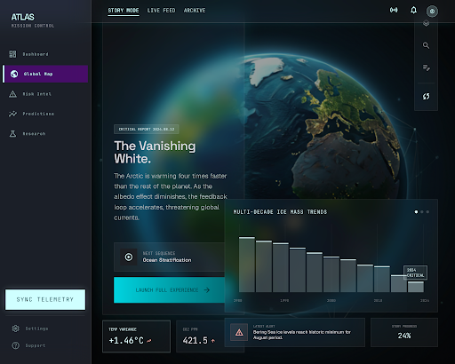 |
| `Dashboard` — Live operational dashboard with: current weather + AQI from OpenWeather, 7-day forecast chart, temperature + precipitation, station history from NOAA (max/min temp, precipitation), air quality timeline (PM2.5, PM10, AQI), risk radar (flood/wildfire/heatwave/storm scores gauge), and global climate anomaly timeline. | 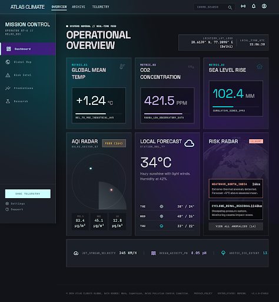 |
| `Global Map` — Interactive 2D map (Plotly Scattergeo) with satellite basemap toggle. Spatial heatmap, latitude profile, and globe (3D orthographic) visualizations of NetCDF climate fields (temperature, precipitation, pressure). Supports multiple projections: analyst contour, dense field, regional focus, comparison delta, orbital. Animation frame slider for temporal data. | 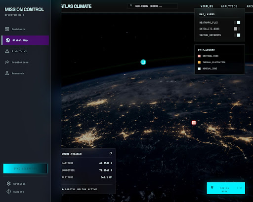 |
| `Climate Signals` — Long-range anomaly detection with: temperature trend decomposition (observed + trend line + anomaly markers), year-over-year comparison (selected year vs baseline), seasonal profile (monthly climatology bar chart), and warming stripe visualization. Dual-column layout pairing chart + explanation panel per signal. | 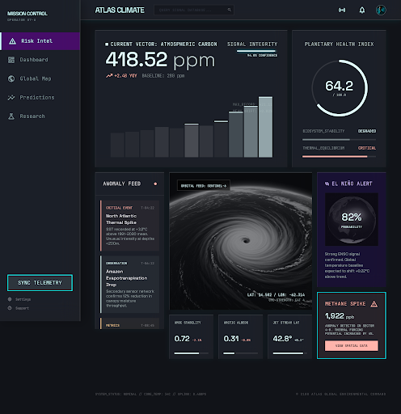 |
| `Risk Intelligence` — Multi-hazard risk scoring dashboard with: gauge indicators for flood, wildfire, heatwave, and storm risk (0–100). Combined risk radar (polar chart). Risk timeline showing hazard trends over time. Ranked risk bar chart. Expandable per-hazard detail panels with descriptions of each risk factor. | 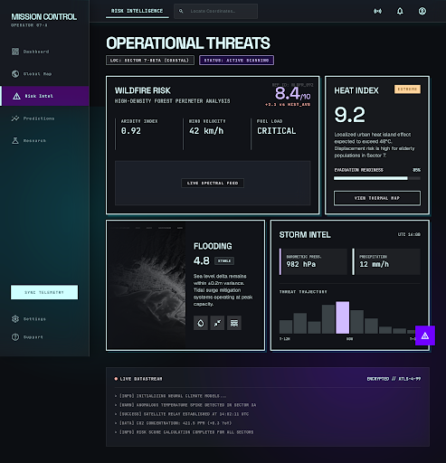 |
| `Predictions` — Model-assisted forecasting with: observed vs forecast line chart with confidence bands, anomaly bar chart (positive/negative anomalies), forecast delta (temperature shifts + precipitation probability), seasonal profile, and natural-language query input for AI-powered climate questions. Tabbed layout per analysis mode. | 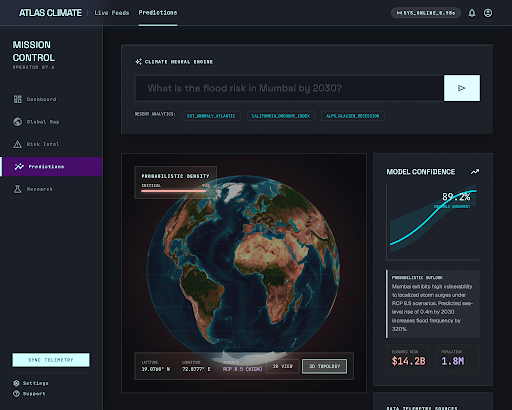 |
| `Data Explorer` — Open exploration workspace with: dataset/variable selector (NetCDF dimensions), spatial heatmap, latitude profile, and animated heatmap with year slider + play button. Compare mode (side-by-side split view for two time periods). Timelapse animation across all years. Full-screen and extraction controls. | 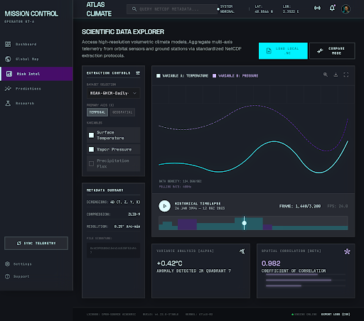 |
| `Research Lab` — Simulation and testing workspace with: dataset uploader (.nc files), scenario configuration (warming offset, precipitation multiplier, sea-level rise), simulation engine that applies scenario deltas to base dataset. Visualization of simulated vs baseline fields. Model comparison view and export results. | 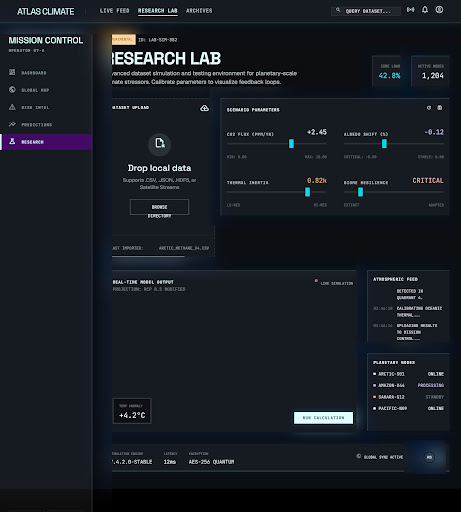 |
| `Reports` — Climate briefing generator with: executive summary, key metrics table, risk overview, data source citations. Generates downloadable PDF (via ReportLab) or Markdown output. Preview panel before export. Section toggles for including/excluding risk scores, charts, and methodology notes. | 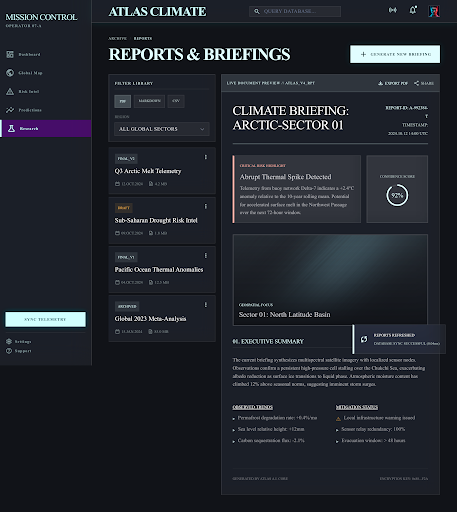 |
| `Settings` — API credential management and source configuration. Input fields for OpenWeather API key (with visibility toggle) and NOAA token. Connection status indicators for each live source. Default location picker. Source readiness checklist showing which integrations are active vs pending. | 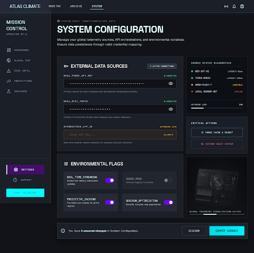 |

## Design System

ATLAS uses **Atmos Mission Control**, a custom design system built on the Stitch MCP platform with these tokens:

- **Color palette**: Deep space (#111318) base, atmospheric cyan (#00dbe7) primary, galactic purple (#7000ff) secondary, warm amber (#ffd49c) tertiary
- **Typography**: Space Grotesk (headlines), Geist (body), JetBrains Mono (data), Inter (UI labels)
- **Glassmorphism**: `backdrop-filter: blur(20px) saturate(180%)`, `rgba(255,255,255,0.05)` fill, inner-edge highlights
- **Border radius**: 0.25rem (sm), 0.5rem (md), 0.75rem (lg)
- **Spacing**: 4px base unit, multipliers for `--atlas-space-sm` (16px), `--atlas-space-md` (32px), `--atlas-space-lg` (48px)

> Full design tokens and component specs are available in `assets/stitch/`.

## Live APIs

Deploy-profile live integrations:

- `NASA GIBS`
- `NOAA Climate Data Online`
- `OpenWeatherMap`

Deferred for the hackathon deploy profile:

- `Copernicus Climate Data`
- `Google Earth Engine`

## Credentials

ATLAS now defaults to server-side credentials only:

1. environment variables
2. `.streamlit/secrets.toml`
3. optional runtime inputs only when `ATLAS_ENABLE_RUNTIME_CREDENTIAL_INPUTS=true`

Supported names:

```bash
OPENWEATHER_API_KEY=<your key>
NOAA_API_TOKEN=<your token>
ATLAS_DEFAULT_LOCATION=Delhi, IN
ATLAS_ENABLE_RUNTIME_CREDENTIAL_INPUTS=false
```

An example template is included at `.streamlit/secrets.example.toml`.

## Local Setup

1. Create and activate a Python 3.10+ environment.
2. Install dependencies:

```bash
pip install -r requirements.txt
```

3. Start the app:

```bash
streamlit run app.py
```

4. Add server-side credentials through `.streamlit/secrets.toml` or environment variables.

## Deploy to Streamlit Community Cloud (free)

1. Push this repo to your GitHub account
2. Go to [share.streamlit.io](https://share.streamlit.io) and sign in with GitHub
3. Click **"New app"**, select this repo, branch `main`, file `app.py`
4. In **Settings → Secrets**, add:
   ```toml
   OPENWEATHER_API_KEY = "your_key_here"
   ATLAS_DEFAULT_LOCATION = "Delhi, IN"
   ```
5. Click **"Deploy"** — auto-deploys on every `git push` to `main`

## Verification

Run the lightweight smoke test:

```bash
python smoke_check.py
```

Expected output:

```text
ATLAS smoke check passed.
```

Run the live provider check before deployment:

```bash
python live_api_check.py
```

This verifies the configured OpenWeather, NOAA, and NASA GIBS paths against a known diagnostic location.

## Historical Dataset

The bundled synthetic dataset is generated automatically on first launch and includes:

- `t2m`
- `precipitation`
- `sea_level_pressure`
- `wind_speed`

Expected coordinate names:

- `time`
- `lat` or `latitude`
- `lon` or `longitude`

## Notes

- The historical workspace remains usable even when live APIs are offline.
- `Reports` falls back to markdown bytes if PDF libraries are unavailable.
- `runtime.txt` pins the hosted Python version for Streamlit deployments.
- Copernicus and Google Earth Engine were intentionally deferred from the deploy profile to keep the hackathon demo reliable.
