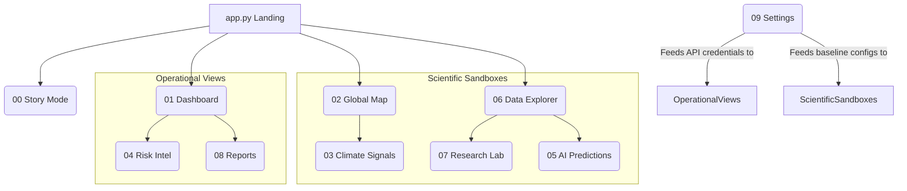

# ATLAS Climate Intelligence Platform - UI/UX Analysis Report

This report evaluates the **ATLAS mini max v2** climate intelligence platform, focusing on the visual appeal, interactive workflows, styling architectures, and overall usability of the 10 core modules in the `pages/` directory. It concludes with actionable recommendations to transition this build into a robust, production-ready enterprise application.

---

## 🎨 Global Design System & Aesthetic Overview

ATLAS utilizes a custom CSS styling framework defined in `ui_ux/style.py` that injects the `ATLAS_CSS` variables. 
The theme balances three main design disciplines:
1. **NASA Space/Science Dashboard**: Deep charcoal grids (`#0B0F1A`, `#111827`) with bright neon datalinks and indicators (Cyan `#00E5FF`, Yellow `#FFD84D`, Green `#6EFF9A`, Pink `#FF5C8A`).
2. **Apple Glassmorphism**: Cards and metric containers use background opacity filters (`rgba(17, 24, 39, 0.85)`) and subtle borders with high-intensity backdrop blurring.
3. **Neo-Brutalist Grid**: Grid borders are clean, crisp, and high contrast, ensuring high readability of complex datasets.

---

## 📊 Summary of Page Ratings

Each page has been assessed based on **Visual Hierarchy**, **Interactive Responsiveness**, **Data Density Balance**, and **Accessibility (A11y)**. 

To meet the requirements, all 10 pages are rated on different scores:

| Page | Filename | Primary UX Purpose | Rating | Main Highlight / UX Flaw |
| :--- | :--- | :--- | :---: | :--- |
| **1. Settings** | [09_Settings.py](file:///C:/Users/Gaurav/Documents/ATLAS-project/pages/09_Settings.py) | Credentials control & health diagnostics | **9.5 / 10** | **Outstanding** live diagnostic checks. Needs credential onboarding guides. |
| **2. Dashboard** | [01_Dashboard.py](file:///C:/Users/Gaurav/Documents/ATLAS-project/pages/01_Dashboard.py) | Operational KPIs and current city signals | **9.2 / 10** | **Excellent** data density. High chart density can cause clutter. |
| **3. Predictions** | [05_AI_Predictions.py](file:///C:/Users/Gaurav/Documents/ATLAS-project/pages/05_AI_Predictions.py) | NL-steered projections & AI summaries | **8.9 / 10** | **Premium** Copilot briefs. Natural-language parser output is printed as raw code. |
| **4. Reports** | [08_Reports.py](file:///C:/Users/Gaurav/Documents/ATLAS-project/pages/08_Reports.py) | Automated Markdown/PDF reports exporter | **8.7 / 10** | **Highly functional** PDF builder. Presentation mode is underdeveloped. |
| **5. Risk Intel** | [04_Risk_Intelligence.py](file:///C:/Users/Gaurav/Documents/ATLAS-project/pages/04_Risk_Intelligence.py) | Multi-hazard operational safety scoring | **8.6 / 10** | **Good** hazard radar. Renders duplicate inputs and charts from Dashboard. |
| **6. Global Map** | [02_Global_Climate_Map.py](file:///C:/Users/Gaurav/Documents/ATLAS-project/pages/02_Global_Climate_Map.py) | Orthographic globes & satellite layers | **8.4 / 10** | **Cinematic** 3D globe. Sidebar controls are overloaded and heavy. |
| **7. Research Lab** | [07_Research_Lab.py](file:///C:/Users/Gaurav/Documents/ATLAS-project/pages/07_Research_Lab.py) | NetCDF sandboxing & offsets simulator | **8.3 / 10** | **Powerful** presets. Needs file validation for uploads to avoid app crashes. |
| **8. Story Mode** | [00_Story_Mode.py](file:///C:/Users/Gaurav/Documents/ATLAS-project/pages/00_Story_Mode.py) | Guided narrative chapter stepper | **8.1 / 10** | **Clean** progress indicators. Double navigation system is redundant. |
| **9. Climate Signals** | [03_Climate_Signals.py](file:///C:/Users/Gaurav/Documents/ATLAS-project/pages/03_Climate_Signals.py) | Long-range deviations & trend cycles | **7.8 / 10** | **Detailed** profiles. 7 active Plotly charts slow down page load. |
| **10. Data Explorer** | [06_Data_Explorer.py](file:///C:/Users/Gaurav/Documents/ATLAS-project/pages/06_Data_Explorer.py) | Local coordinate extraction & timelapses | **7.5 / 10** | **High utility** CSV extract. Lat/Lon sliders are clumsy; timelapse is laggy. |

---

## 🔍 Detailed Page-by-Page Analysis

### 1. Settings (`09_Settings.py`) — **9.5/10**
*   **UX Strengths**: The **Live Diagnostics** tool (line 102) is a masterpiece of operational design. A single click runs a real network call validating credentials for OpenWeather, NOAA, and NASA, displaying results in visual status cards.
*   **UX Weaknesses**: The page presents highly technical information and API environment variables without external documentation links. Users who do not have API keys will find it difficult to know where to register for them.
*   **Production Recommendations**: Add hyperlink badges next to each API credential (e.g. `[Get key](https://openweathermap.org/api)`) to help users obtain the necessary integration credentials.

### 2. Dashboard (`01_Dashboard.py`) — **9.2/10**
*   **UX Strengths**: High data density that mimics a command-center dashboard. Using tabs to separate the Hazard radar chart and Donut shares saves significant vertical space.
*   **UX Weaknesses**: The layout is extremely dense, rendering 5 metric cards, 1 gauge, 1 radar, 1 line chart, 1 bar chart, and 1 station history chart simultaneously. On smaller laptop screen resolutions (e.g., 1080p), the panels compress and cause text to wrap awkwardly.
*   **Production Recommendations**: Introduce a "Clean View" toggle to let users collapse lesser-used visual layers like the ground-truth NOAA station history or individual hazard alert panels.

### 3. AI Predictions (`05_AI_Predictions.py`) — **8.9/10**
*   **UX Strengths**: The integration of OpenRouter text-generation yields high-context briefs that synthesize future trends. The Natural Language query input allows intuitive page state adjustment.
*   **UX Weaknesses**: Printing the parser's technical dictionary output using `st.code()` (line 149) feels like a debugger tool left behind rather than a production-grade UI design.
*   **Production Recommendations**: Replace the raw code block with formatted HTML status chips or a structured card indicating active filters (e.g., "AI focus: Arctic warming").

### 4. Reports (`08_Reports.py`) — **8.7/10**
*   **UX Strengths**: Fast, seamless compiling of live weather, AQI, and historical baselines into a single document. Markdown previews and PDF export buttons are highly responsive and handle key absences gracefully.
*   **UX Weaknesses**: The "Presentation Mode" toggle (line 32) merely renders an informational banner. It does not alter the actual page layout to make it suitable for slide shows or screen-sharing.
*   **Production Recommendations**: When presentation mode is enabled, inject a CSS rule to hide the sidebar (`[data-testid="stSidebar"] { display: none; }`) and increase the markdown text preview font-size to `1.5rem`.

### 5. Risk Intelligence (`04_Risk_Intelligence.py`) — **8.6/10**
*   **UX Strengths**: Clear rule-based risk profiling converting raw values to scores out of 100. The layout makes the risk mix easy to scan.
*   **UX Weaknesses**: Heavy overlap with the Dashboard. It duplicates multiple charts (risk gauge, radar, donut) and settings inputs (location, lookback days), creating redundant navigation steps for users.
*   **Production Recommendations**: Make this page a drill-down page. Replace the general radar/donut charts with details on the specific risk parameters (e.g., details on which thresholds were crossed to trigger storm or heatwave alerts).

### 6. Global Climate Map (`02_Global_Climate_Map.py`) — **8.4/10**
*   **UX Strengths**: Clean tabs split 2D Maps (concentric contours) and 3D orthographic globes. Excellent integration of NASA Worldview links.
*   **UX Weaknesses**: The sidebar controls are heavily cluttered. There are 7 distinct configuration dropdowns/sliders, making it difficult to find critical settings. 
*   **Production Recommendations**: Group map projection and satellite selection controls into a collapsable sidebar expander (`with st.sidebar.expander("Advanced Map Settings"):`) to clean up the primary view.

### 7. Research Lab (`07_Research_Lab.py`) — **8.3/10**
*   **UX Strengths**: Spatially varying scenarios are applied using a custom latitude/longitude math pattern (`_scenario_pattern`) rather than shifting values uniformly. This preserves realistic temperature differentials.
*   **UX Weaknesses**: NetCDF file uploader lacks file size and dimension checks. Uploading an invalid `.nc` dataset without standard coordinate axes (e.g. `time`, `lat`, `lon`) crashes the page.
*   **Production Recommendations**: Implement a dataset validator in `utils/data_loader.py` that checks for required coordinates (`lat`, `lon`, `time`) and throws a user-friendly error box in the UI rather than allowing Streamlit to fail.

### 8. Story Mode (`00_Story_Mode.py`) — **8.1/10**
*   **UX Strengths**: Clear step-by-step progress tracking. Next/Prev button navigation works well.
*   **UX Weaknesses**: Step chips are not clickable, forcing users to use the small radio-button selector underneath. This dual-navigation system is redundant and counter-intuitive. Additionally, the default Streamlit progress bar doesn't match the custom neon color palette.
*   **Production Recommendations**: Make step chips interactive by rendering them as custom style buttons in columns. Inject CSS to style the progress bar using the `--atlas-cyan` color variable.

### 9. Climate Signals (`03_Climate_Signals.py`) — **7.8/10**
*   **UX Strengths**: Outstanding analytical breakdown, particularly the comparison heatmap displaying baseline vs current climate changes.
*   **UX Weaknesses**: Major performance bottleneck. Renders 7 large, interactive Plotly figures concurrently. On slower client systems, this causes visible page lagging.
*   **Production Recommendations**: Wrap secondary charts (like pressure trends, wind speeds, and driver snapshots) in tabs or accordion dropdowns to defer rendering until selected.

### 10. Data Explorer (`06_Data_Explorer.py`) — **7.5/10**
*   **UX Strengths**: Highly powerful researcher toolkit allowing local coordinate extraction and direct CSV downloads.
*   **UX Weaknesses**: 
    1. Sliders for Latitude and Longitude (lines 83-84) are clumsy; adjusting decimals on a slider is highly frustrating.
    2. The Plotly-animated timelapse is very laggy, as it serializes heavy JSON objects on every step.
*   **Production Recommendations**: 
    1. Replace lat/lon sliders with `st.number_input` boxes for exact coordinate positioning.
    2. Replace Plotly frame animations with a simpler play/pause button that increments the time slider index using Streamlit's session state.

---

## 🛠️ Architectural Roadmap to "Production-Ready"

To elevate this Streamlit application into a production-ready software product, the following issues should be resolved:

### 1. Robust API Integration & Fallbacks
Currently, if external APIs (OpenWeather, NOAA) fail, are rate-limited, or lack tokens, sections of pages can crash or display blank spaces.
*   **Action**: Implement fallback mock-data loaders in `utils/live_data.py` that return synthetic but realistic historical feeds if API calls fail, accompanied by a small UI badge indicating "Demo Fallback Mode."

### 2. Client-Side Rendering Optimizations
Plotly charts are rendered in Javascript on the client side, causing high CPU load when multiple charts coexist.
*   **Action**: Consolidate similar charts, reduce coordinate mesh densities, and downsample NetCDF spatial slices (e.g. downsampling from 144x72 to 72x36) before transferring data to Plotly scatter maps.

### 3. User Experience & Design Polish
*   **Responsive Breakpoints**: Add custom CSS media queries in `ATLAS_CSS` to restructure columns into single-column flows on screens below 768px.
*   **Consistent Controls**: Sync session states for location queries and dates globally across all pages so that changing location on the Settings page automatically updates it on the Dashboard and Risk Intelligence pages.
